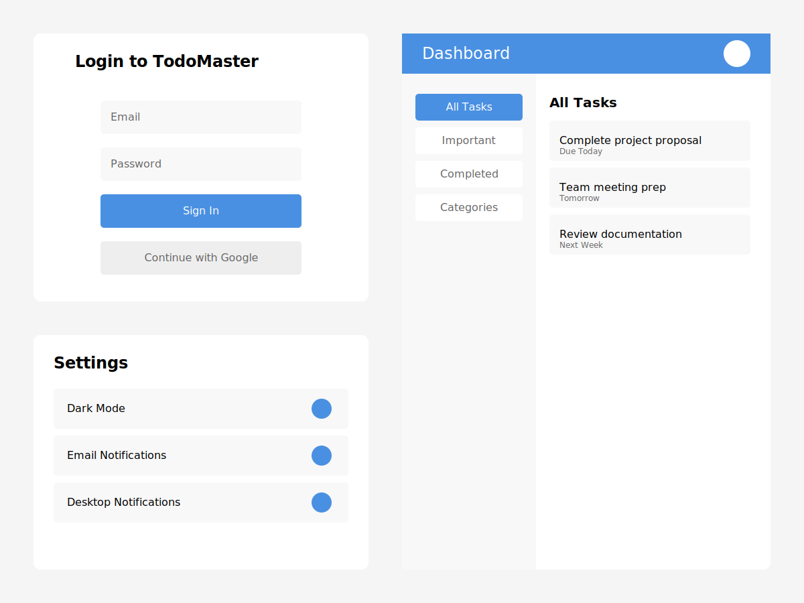
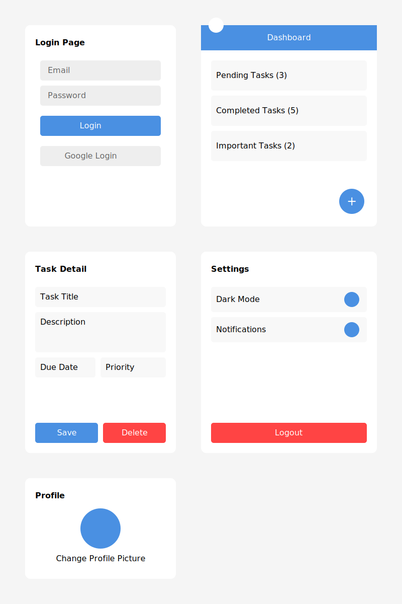

# **To-Do List App (Web & Mobile)**  

## **Project Overview**  
The **To-Do List App** is a task management application designed for both **web and mobile platforms**. It allows users to create, edit, delete, and categorize tasks efficiently. The app provides a **seamless experience across devices**, enabling users to stay productive and organized.  

## **Objectives**  
- Provide a **simple and user-friendly** interface for task management.  
- Enable **real-time synchronization** of tasks across web and mobile.  
- Allow users to **set reminders and notifications** for important tasks.  
- Implement **authentication** to store user-specific tasks.
- Ensure **offline support**, allowing users to manage tasks without an internet connection.  

## **Pages and Navigation**  
### **1. Authentication Pages:**  
- **Login Page** → Allows users to sign in using email/password or Google authentication.  
- **Signup Page** → New users can create an account.  

### **2. Dashboard (Home Page):**  
- Displays **all tasks** categorized by status (**Pending, Completed, or Important**).  
- Allows users to **add, edit, delete, and mark tasks as completed**.  
- Provides a **search and filter** option.  

### **3. Task Management Page:**  
- Users can create a **new task** with a title, description, due date, and category.  
- Edit or delete existing tasks.  
- Set **reminders** for tasks.  

### **4. Profile Page:**  
- Users can update their **profile information**.  
- Logout option.  

### **5. Settings Page:**  
- **Theme selection** (Light/Dark Mode).  
- **Notification preferences**.  

## **Tech Stack**  
### **Frontend (Web & Mobile)**  
- **Web**: React.js (with Vite for fast development)  
- **Mobile**: React Native (for cross-platform development)  
- UI Library: **Tailwind CSS / Material UI for Web**, NativeBase for Mobile  

### **Backend**  
- **Node.js + Express.js** (REST API for task management)  
- **Firebase (for authentication and real-time database sync)**  

### **Database**  
- **MongoDB (NoSQL) with Mongoose ORM**  
- OR **PostgreSQL (SQL) with Prisma ORM**  

### **Authentication**  
- Firebase Authentication  
- OR JWT (JSON Web Tokens) for session management  

## Layout Image

---
