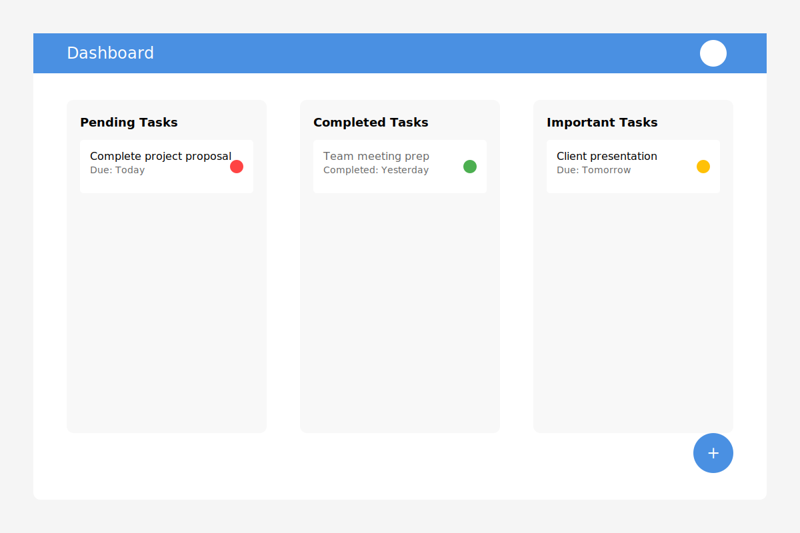

# **Pages - To-Do List App**  

## **1. Authentication Pages**  
### **Login Page** (`/login`)  
- Email/password or Google login  
- "Forgot Password" option  

### **Signup Page** (`/signup`)  
- Create new account  
- Input fields: Name, Email, Password 

## **2. Dashboard (Home Page) (`/dashboard`)**  
- Displays list of tasks categorized as:
  - **Pending**
  - **Completed**
  - **Important**
- "Add New Task" button 
 

## **3. Task Management Page** (`/task/:id`)  
- View, edit, delete tasks  
- Set task priorities  
- Add due dates & reminders
  

## **4. Profile Page** (`/profile`)  
- View & update user information  
- Change profile picture 
 

## **5. Settings Page** (`/settings`)  
- Dark mode toggle  
- Notification settings  
- Logout button  

## **6. Error Page (404)**  
- Displays when a user navigates to an unknown route  
- Redirects to the home page  
